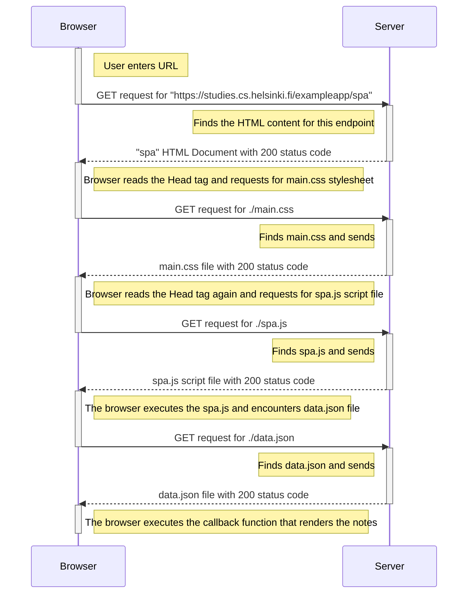

```mermaid
sequenceDiagram
participant Browser
participant Server

    activate Browser
    Note right of Browser: User enters URL
    Browser->>Server: GET request for "https://studies.cs.helsinki.fi/exampleapp/spa"
    deactivate Browser

    activate Server
    Note left of Server: Finds the HTML content for this endpoint
    Server-->>Browser: "spa" HTML Document with 200 status code
    deactivate Server

    activate Browser
    Note right of Browser: Browser reads the Head tag and requests for main.css stylesheet
    Browser->>Server: GET request for ./main.css
    deactivate Browser

    activate Server
    Note left of Server: Finds main.css and sends
    Server-->>Browser: main.css file with 200 status code
    deactivate Server

    activate Browser
    Note right of Browser: Browser reads the Head tag again and requests for spa.js script file
    Browser->>Server: GET request for ./spa.js
    deactivate Browser

    activate Server
    Note left of Server: Finds spa.js and sends
    Server-->>Browser: spa.js script file with 200 status code
    deactivate Server

    activate Browser
    Note right of Browser: The browser executes the spa.js and encounters data.json file
    Browser->>Server: GET request for ./data.json
    deactivate Browser

    activate Server
    Note left of Server: Finds data.json and sends
    Server-->>Browser: data.json file with 200 status code
    deactivate Server

    activate Browser
    Note right of Browser: The browser executes the callback function that renders the notes
    deactivate Browser
```
